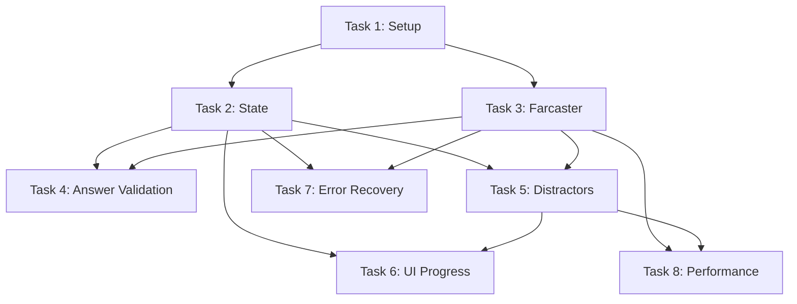

#### Setup
- [ ] Task 1: Create Start Screen with Basic Navigation  
  - Build initial frame with welcome screen and navigation to start quiz  
  - Depends on: None  

#### Core Features  
- [ ] Task 2: Implement Quiz State Serialization  
  - Build base64 JSON state system for tracking progress  
  - Depends on: Task 1  
- [ ] Task 4: Basic Answer Validation Flow  
  - Add endpoint to check answers and update scores  
  - Depends on: Task 2, Task 3  
- [ ] Task 7: State Validation & Error Recovery  
  - Add checksum validation and backup trivia logic  
  - Depends on: Task 2, Task 3  
- [ ] Task 8: Performance Optimization  
  - Implement caching for user data and pre-generated answers  
  - Depends on: Task 3, Task 5  

#### API Integration  
- [ ] Task 3: Farcaster Casts Integration  
  - Fetch user’s casts via Farcaster API for question generation  
  - Depends on: Task 1  
- [ ] Task 5: Distractor Answer Generation  
  - Integrate 3rd-party service for fake answer options  
  - Depends on: Task 3  

#### UI/UX  
- [ ] Task 6: Progress-Driven Frame Rendering  
  - Build dynamic images showing progress and final scores  
  - Depends on: Task 2, Task 5  

---

### Implementation Plan  
**Priority Order**:  
1. **Task 1** → 2. **Task 2** → 3. **Task 3** → 4. **Task 4** → 5. **Task 5** → 6. **Task 6** → 7. **Task 7** → 8. **Task 8**  

**Rationale**:  
1. Start with **Setup (Task 1)** to establish foundational navigation.  
2. Prioritize **state management (Task 2)** to enable user progress tracking.  
3. Integrate **Farcaster (Task 3)** early to populate real quiz content.  
4. Enable **answer validation (Task 4)** to create interactive flow.  
5. Add **distractors (Task 5)** to improve question quality.  
6. Enhance visuals with **dynamic rendering (Task 6)** for user feedback.  
7. Strengthen reliability with **state validation (Task 7)**.  
8. Optimize speed last **(Task 8)** after core features are stable.  

**Dependency Map**:  
